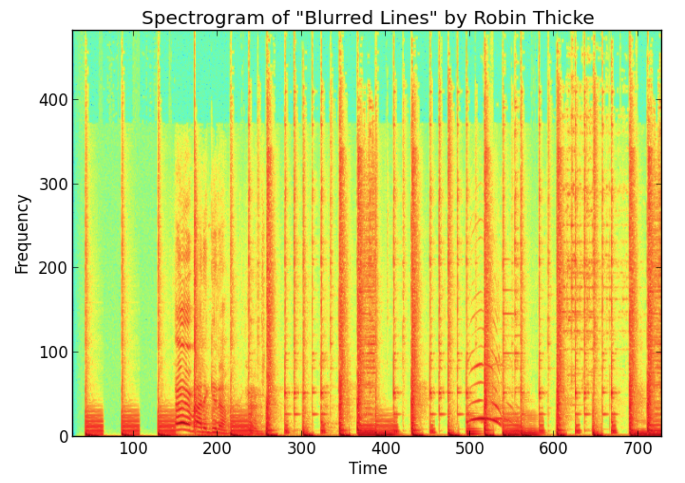

Audio Match
==========
I once searched Audio Matches algorithms on google, most of the solutions used 
FFT to convert the audio samples into Frequency domains  and then calculate the
[fingerprints](http://en.wikipedia.org/wiki/Acoustic_fingerprint) on the frequency domain. 
Examples include:
*[Shazam](http://www.ee.columbia.edu/~dpwe/papers/Wang03-shazam.pdf)
*[Microsoft](http://developer.nokia.com/community/wiki/Sound_pattern_matching_using_Fast_Fourier_Transform_in_Windows_Phone)
*[S.V.Rice](http://www.comparisonics.com/AES_ID31.pdf)

[shazam](http://www.ee.columbia.edu/~dpwe/papers/Wang03-shazam.pdf) Describe a algorithm which use an FFT over small windows of time in the audio's samples to
create a [spectrogram](http://en.wikipedia.org/wiki/Spectrogram) of the audio. Below is a spectrogram example refered from [WILLDREVO](http://willdrevo.com/fingerprinting-and-audio-recognition-with-python/)

Audio recognition algorithm implemented in Java, see the explanation here:  

It can tell whtere two audio files contain one or more segments sounds alike
## Dependencies:

I've only tested this on Unix systems.

* ['Java1.6']

##Compile:
Use Makefile, under project directory type: 
$ make
$ chmod +x ./dam
$ ./dam -f <pathname> -f <pathname>
$ ./dam -d <pathname> -d <pathname>
$ ./dam -f <pathname> -d <pathname>
$ ./dam -d <pathname> -f <pathname>

## How does it work?

